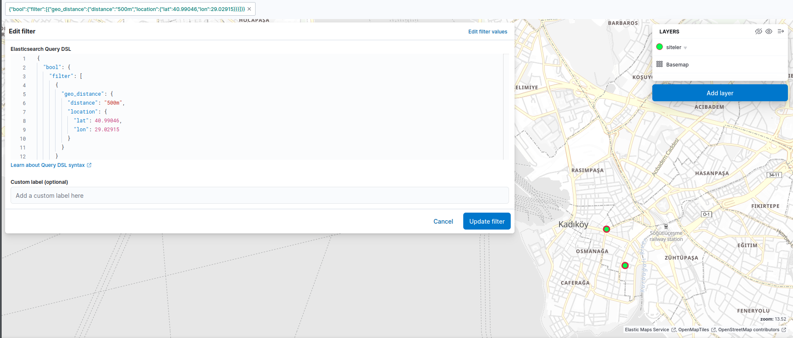
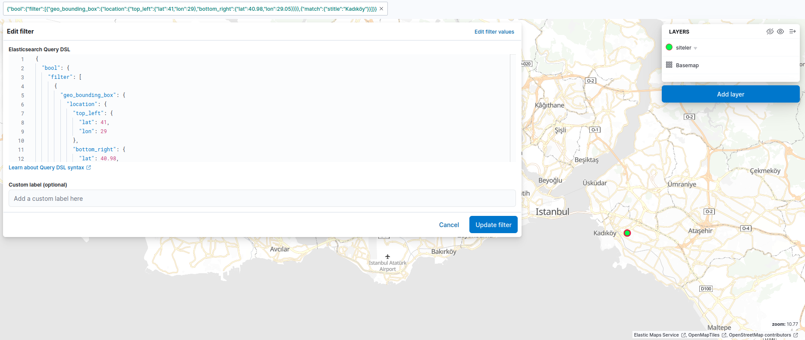

# Coğrafi Büyük Veri Uygulaması: Elasticsearch ile Veri Yükleme ve Sorgulama 🌍

*Bu proje, coğrafi verileri içeren bir JSON dosyasını okuyan, Elasticsearch'e özel bir `geo_point` mapping'i ile verimli bir şekilde yükleyen ve üzerinde  coğrafi sorgular yapılmasına olanak tanıyan bir Python ETL (Extract, Transform, Load) script'idir.*

-----

## 1\. Projenin Amacı

Bu projenin temel amacı, büyük hacimli coğrafi verilerin Elasticsearch'e nasıl yükleneceğini ve bu verinin Kibana gibi araçlarla nasıl sorgulanıp görselleştirileceğini, veri mühendisliği pratikleriyle göstermektir. Proje, aşağıdaki adımları kapsar:

  * Elasticsearch'te coğrafi sorgular için  şema (**mapping**) ile indeks oluşturma.
  * Büyük bir JSON dosyasını, hafızayı verimli kullanarak (**generator**'lar ile) okuma.
  * Veriyi, Elasticsearch'ün **`_bulk` API**'sini kullanarak yüksek performansla ve toplu halde indekse yükleme.
  * Yüklenen veri üzerinde yarıçap, dikdörtgen ve en yakın/en uzak nokta gibi **geospatial sorgular** yapma.

## 2\. Sistem Mimarisi ve Veri Akışı

Bu proje, tek seferlik bir toplu veri yükleme (batch ingestion) iş akışını modellemektedir.

**Veri Akışı:**
`[data/istanbul_siteler.json]` -\> `[Python Script (bulk_indexer.py)]` --(**SSH Tüneli**)--\> `[Elasticsearch (siteler indeksi)]` \<--\> `[Kibana (Harita Görselleştirmesi)]`

1.  **Kaynak:** `data/` klasöründeki `istanbul_siteler.json` dosyası, `stitle` (site adı) ve `location` (konum) bilgilerini içerir.
2.  **ETL Script'i (`bulk_indexer.py`):**
      * **Extract:** JSON dosyasını diskten okur.
      * **Transform:** Her bir JSON nesnesini, Elasticsearch `_bulk` API'sinin beklediği formata (`{_index: ..., _source: ...}`) dönüştürür.
      * **Load:** Bu verileri, güvenli bir SSH tüneli üzerinden, sunucuda çalışan Elasticsearch'e toplu olarak yükler.
3.  **Depolama ve Analiz (`Elasticsearch`):** Veriler, `geo_point` olarak tanımlanmış `location` alanı sayesinde, coğrafi sorgulara hazır bir şekilde `siteler` indeksinde saklanır.
4.  **Görselleştirme (`Kibana`):** Kullanıcı, Kibana'nın "Maps" uygulaması aracılığıyla bu veriyi interaktif bir İstanbul haritası üzerinde görselleştirebilir ve filtreleyebilir.

## 3\. Kullanılan Teknolojiler

  * **Veri Depolama ve Arama:** Elasticsearch 8.x
  * **Veri Görselleştirme:** Kibana 8.x (Maps)
  * **Veri Yükleme (ETL):** Python 3, `elasticsearch-py` (istemci), `python-dotenv`
  * **Altyapı:** DigitalOcean Droplet (Ubuntu Sunucu)
  * **Geliştirme ve Güvenlik:** Git & GitHub, `venv`, `utils/logger.py`, **SSH Tüneli**

## 4\. Proje Yapısı

```
geographic-big-data-app/
├── configs/
│   └── settings.py             # .env'den ayarları okuyan modül
├── data/
│   └── istanbul_siteler.json   # Ham veri kaynağı
├── utils/
│   └── logger.py               # Merkezi loglama modülü
│
├── geospatial-app/
│   └── venv-geo/               # Projeye özel sanal ortam
│   └── requirements.txt        # Sanal ortam kütüphane listesi
│   └── bulk_indexer.py         # Ana ETL script'i
│   │   
│   └── kibana-requests-outputs # Kibana uygulama örnekleri
│       └── <kibana_Query_DSL_ve_çıktıları>.json
│       └── <kibana_maps_görseleri>.png
│
├── .env                        # Hassas bağlantı bilgileri 
├── .gitignore
└── README.md
```

## 5\. Kurulum ve Çalıştırma

### Ön Gereksinimler

  * **Sunucu:** Elasticsearch ve Kibana servisleri çalışır durumda olmalıdır.
  * **Yerel Bilgisayar:** Python 3 ve `venv` kurulu olmalıdır.

### Çalıştırma Adımları

1.  **Kurulum:**

    ```bash
    # Projeyi klonla
    git clone <proje_url>
    cd geographic-big-data-app/geospatial-app

    # Sanal ortamı oluştur ve aktif et
    python3 -m venv venv-geo
    source venv-geo/bin/activate

    # Gerekli kütüphaneleri kur
    pip install -r requirements.txt 
    ```

2.  **.env Dosyasını Oluştur:** Proje ana dizininde `.env` adında bir dosya oluştur ve içine Elasticsearch bağlantı bilgilerini gir:

    ```env
    ELASTIC_HOST=localhost
    ELASTIC_PORT=9200
    ELASTIC_USER=elastic
    ELASTIC_PASSWORD=SIFRENIZ
    ELASTIC_FINGERPRINT=AB:CD:EF:...:34:56:78:90
    ```

3.  **SSH Tünelini Başlat:** Ayrı bir terminalde, sunucuya tüm yönetim portlarını yönlendiren SSH tünelini başlat ve açık bırak (`ssh sunucum`).

4.  **Script'i Çalıştır:**

    ```bash
    # venv aktifken, proje kök dizininden
    python3 -m geospatial-app.bulk_indexer
    ```

    Script çalışacak, indeksi oluşturacak ve 10,064 kaydı Elasticsearch'e yükleyecektir.

## 6\. Elasticsearch Sorgu Örnekleri (Kibana Dev Tools)

Veri yüklendikten sonra Kibana Dev Tools üzerinden aşağıdaki gibi güçlü sorgular yapılabilir:

#### Belirli Bir Noktaya 250m Mesafedeki Yerler

```json
GET /siteler/_search
{
  "query": {
    "bool": {
      "filter": [{
        "geo_distance": {
          "distance": "250m",
          "location": { "lat": 40.9904, "lon": 29.0283 }
        }
      }]
    }
  }
}
```


#### Bir Alandaki ve Adında "Kadıköy" Geçen Yerler

```json
GET /siteler/_search
{
  "query": {
    "bool": {
      "filter": [
        {
          "geo_bounding_box": {
            "location": {
              "top_left": { "lat": 41.0, "lon": 29.0 },
              "bottom_right": { "lat": 40.98, "lon": 29.05 }
            }
          }
        },
        { "match": { "stitle": "Kadıköy" } }
      ]
    }
  }
}
```


## 7\. Best Practice ve Profesyonel Yaklaşımlar

  * **Açık Şema Tanımı (Explicit Mapping):** `geo_point` gibi özel veri tiplerinin doğru şekilde indekslendiğinden emin olmak için indeks şeması en başta manuel olarak oluşturulmuştur.
  * **Ölçeklenebilir Veri Yükleme:** Büyük JSON dosyasını hafızaya yüklemeden, `yield` ile bir **generator** fonksiyonu oluşturarak ve bunu `elasticsearch.helpers.bulk` ile kullanarak ölçeklenebilir bir veri yükleme mimarisi kurulmuştur.
  * **Güvenli Erişim:** Sunucudaki Elasticsearch API'sine doğrudan internet erişimi tamamen kapatılmış, tüm iletişim güvenli bir **SSH Tüneli** üzerinden sağlanmıştır.